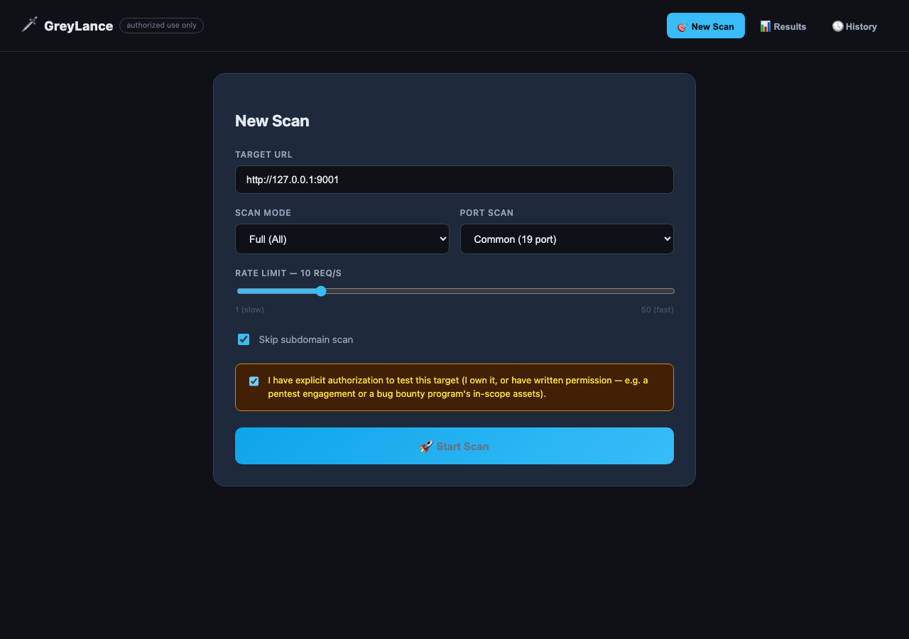
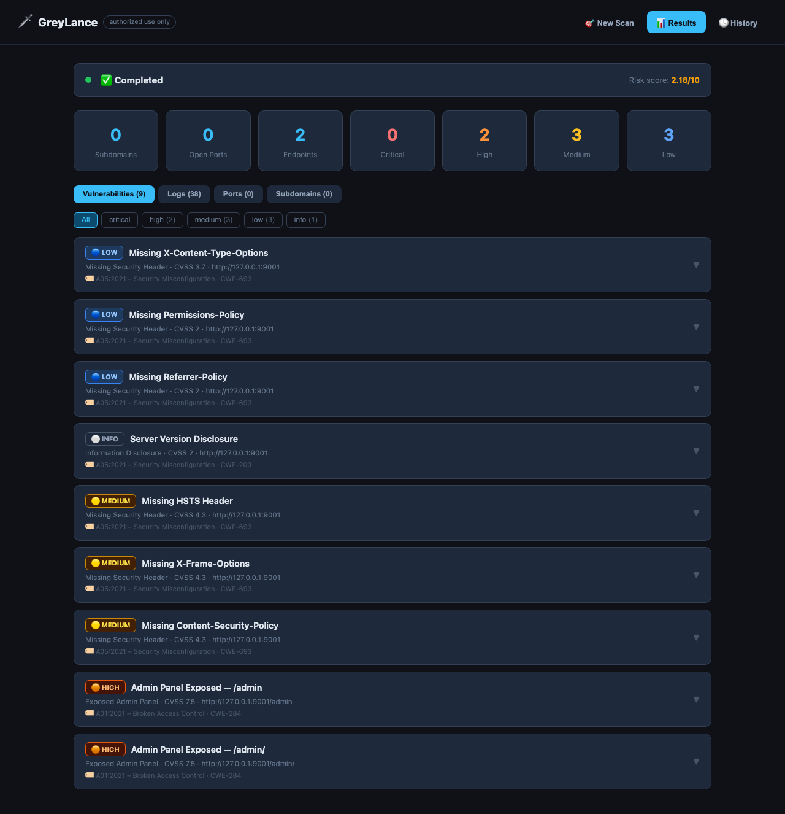
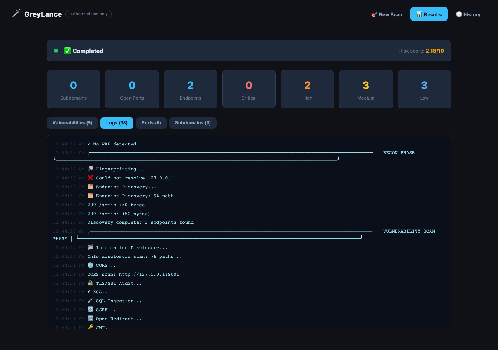
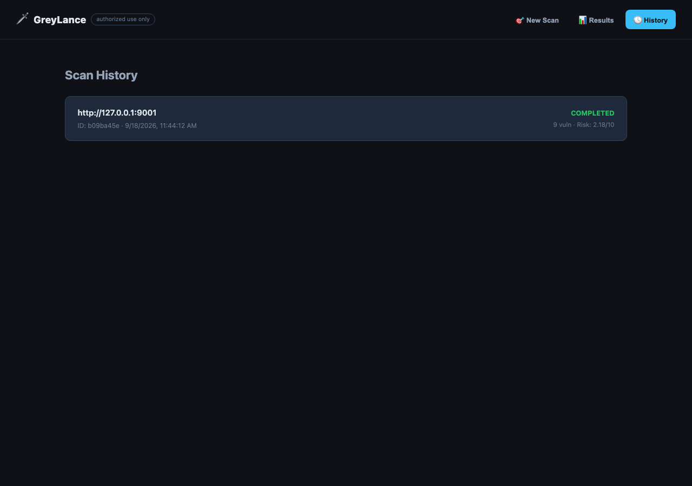

<div align="center">

# 🛡️ GreyLance

**An Advanced, Context-Aware Recon & Automated Web Vulnerability Assessment Framework**

[](https://www.python.org/downloads/)
[](https://opensource.org/licenses/MIT)
[](https://github.com/TorranceTech/GreyLance/actions/workflows/ci.yml)
[](http://makeapullrequest.com)
[](https://github.com/TorranceTech/GreyLance)

[Credits](#-credits--attribution) •
[Key Features](#-key-features) •
[Architecture](#-architecture) •
[Installation](#-installation) •
[Try It Safely](#-try-it-safely) •
[Usage](#-usage) •
[Testing & CI](#-testing--ci) •
[Configuration](#%EF%B8%8F-configuration--risk-assessment) •
[Roadmap](#-roadmap)

</div>

---

## 📌 Overview

**GreyLance** is a modular, high-performance web vulnerability scanner and reconnaissance framework built for **Bug Bounty Hunters**, **Red Teams**, and **Penetration Testers**.

Unlike standard passive scanners, GreyLance combines deep sub-domain discovery, active TCP service fingerprinting, TLS/SSL auditing, and a **Context-Aware Vulnerability Verification Engine** designed to minimize false positives and bypass modern Web Application Firewalls (WAFs) through adaptive rate limiting and jitter control. Every scan is gated behind an explicit authorization confirmation — see [Disclaimer](#️-disclaimer).

---

## 🙏 Credits & Attribution

GreyLance began as a fork of **[BugScanner](https://github.com/eldarshiraliyev/BugScanner) by eldarshiraliyev**, released under the MIT License. The original `LICENSE` file (and its copyright notice) ships unchanged in this repository, as the license requires.

Since the fork, it has been substantially rewritten and extended:

- **Full English localization** — the original shipped with a large portion of its comments, docstrings, and vulnerability text in a mix of languages; all of it has been translated and cleaned up.
- **Mandatory authorization gate** — the CLI and GUI now refuse to run an active scan without an explicit, typed (or flagged) confirmation that the operator is authorized to test the target.
- **TLS/SSL auditing** — a new module checking for weak protocol negotiation, certificate expiry, and self-signed certificates.
- **Expanded security-header and cookie checks** — Referrer-Policy, and Secure/HttpOnly/SameSite cookie flag auditing.
- **OWASP Top 10 (2021) mapping** — every finding is tagged with a best-effort OWASP category alongside its CWE ID.
- **Automated test suite + CI** — a pytest suite covering the core scanning logic, run by GitHub Actions on every push/PR.
- **Docker-based safe lab** — a `docker-compose.yml` that pairs GreyLance with OWASP Juice Shop so it can be exercised against a legal, intentionally-vulnerable target with zero setup.

---

## 🖼 Screenshots

The React/FastAPI GUI, running a real scan against an authorized local target:

| New Scan (authorization gate) | Findings (OWASP-tagged) |
|---|---|
|  |  |

| Live scan log (WebSocket) | Scan History |
|---|---|
|  |  |

---

## 🔥 Key Features

### 🔍 Phase 1 — Reconnaissance & Discovery
* **Subdomain Enumeration:** Dual-engine discovery using **Certificate Transparency Logs (`crt.sh`)** for passive reconnaissance and **Async DNS Bruteforcing** (200+ wordlist) for active discovery.
* **TCP Port Scanner:** High-speed, asynchronous TCP connect scanning across custom ranges (`common`, `extended`, `full`). Features banner grabbing for service version extraction and security hints.
* **Technology Fingerprinting:** Identifies web servers, CMSs, backend frameworks, and frontend libraries via HTTP Response Headers, HTML DOM patterns, and Session Cookies.
* **Endpoint Discovery:** Async path discovery covering 200+ common administration, API (`/graphql`, `/swagger`), auth, debug, and backup endpoints (`.env`, `.git/HEAD`, `actuator/heapdump`).

### 🛡️ Phase 2 — Vulnerability Assessment Engine
* **Reflected XSS Scanner:** Evaluates parameter reflection in `text/html` contexts with execution-aware payload sets, lowering noise and false positives.
* **SQL Injection (SQLi) Verification:** Integrates Error-Based SQLi checks across 30+ database error patterns and **Time-Based Double-Check Verification** (`SLEEP(3)` vs `SLEEP(6)`) to eliminate network latency false positives.
* **CORS Misconfiguration Auditor:** Identifies wildcard origins, arbitrary origin reflection, and dangerous `Access-Control-Allow-Credentials: true` combinations with auto-generated PoC exploits.
* **TLS/SSL Auditor:** Flags weak/deprecated protocol negotiation (SSLv2/3, TLSv1.0/1.1), self-signed certificates, and certificate expiry.
* **SSRF & Open Redirect:** Tests for Cloud Metadata exposure (AWS, GCP) and protocol handler leaks (`file://`), along with location-header redirection validation.
* **JWT Security Auditor:** Automates `alg: none` bypass checks, signature verification, algorithm confusion (RS256 → HS256), and weak secret brute-forcing.
* **IDOR & Path Tampering:** Evaluates parameter/path numerical shifts and HTTP Method Swapping (e.g., `DELETE`/`PUT` verb tampering).
* **Sensitive Data Exposure:** Scans responses for leaked AWS keys, Private RSA keys, GitHub/Stripe/Slack tokens, `.git` repository exposures, and Directory Listing.
* **Security Header & Cookie Auditor:** Flags missing HSTS, CSP, X-Frame-Options, X-Content-Type-Options, Permissions-Policy, and Referrer-Policy headers, plus cookies missing `Secure`/`HttpOnly`/`SameSite`.
* **Business Logic Checks:** Mass assignment / privilege escalation, rate-limit bypass on auth endpoints, price/quantity manipulation, and password-reset host-header injection.
* **Nuclei Integration:** Seamlessly wraps ProjectDiscovery's `nuclei` engine (if installed) to execute thousands of CVE and misconfiguration templates directly into the consolidated report.

### 🏷️ OWASP Top 10 Mapping

Every finding is tagged with a best-effort **OWASP Top 10 (2021)** category (e.g. `A03:2021 – Injection`) next to its CWE ID, in both the CLI/HTML report and the GUI. This is a heuristic classification meant to make triage and reporting faster — not an authoritative or exhaustive mapping (a few vuln types, like generic "Business Logic" findings, legitimately span more than one category).

### ⚡ Resilience & Evasion Capabilities
* **Adaptive Token-Bucket Rate Limiter:** Dynamically adjusts Requests Per Second (RPS) upon receiving `429 Too Many Requests` or `503 Service Unavailable`, preventing WAF IP bans.
* **WAF Detection & Jitter Engine:** Detects Cloudflare, Akamai, and AWS WAF signatures to apply randomized delays and stealth payload reductions.
* **Dynamic Reporting:** Generates structured JSON outputs alongside interactive, dark-themed HTML reports featuring CVSS v3.1 severity scores, animated risk metrics, and ready-to-use exploit PoCs.

---

## 🏗 Architecture

GreyLance uses a modular, asynchronous architecture built on top of `asyncio` and `httpx`:

```text
cli.py / gui/app.py ──> core/scanner.py (GreyLanceScanner orchestrator)
                          ├── recon/
                          │   ├── subdomain.py         # crt.sh + Async DNS
                          │   ├── portscan.py          # TCP Connect & Banner Grab
                          │   ├── fingerprint.py       # Headers, DOM, Cookies & header/cookie audit
                          │   └── discovery.py         # Endpoint Bruteforce
                          ├── vulns/
                          │   ├── xss.py               # Reflected XSS Engine
                          │   ├── sqli.py              # Error & Double-Check Time-Based
                          │   ├── cors.py              # Origin Reflection & Credentials
                          │   ├── tls_audit.py         # TLS Protocol & Certificate Audit
                          │   ├── ssrf.py              # Metadata & Protocol Leaks
                          │   ├── redirect.py          # Open Redirect Auditor
                          │   ├── jwt.py               # Alg None, Confusion & Weak Secret
                          │   ├── idor.py              # Parameter & Verb Tampering
                          │   ├── disclosure.py        # Token & Key RegEx Extractor
                          │   ├── business_logic.py    # Privilege Escalation, Mass Assignment, etc.
                          │   └── nuclei_wrapper.py    # Native Nuclei CLI Wrapper
                          └── core/
                              ├── rate_limiter.py      # Adaptive RPS & Jitter
                              ├── http_client.py       # Async HTTP Wrapper
                              ├── models.py            # Dataclasses, CVSS & OWASP Mapping
                              └── reporter.py          # JSON & Jinja2 HTML Generator

tests/                        # pytest suite (core logic, no live network calls)
.github/workflows/ci.yml      # Lint (ruff) + tests on every push/PR
Dockerfile / docker-compose.yml  # Containerized run + OWASP Juice Shop lab
```

---

## 📦 Installation

```bash
git clone https://github.com/TorranceTech/GreyLance.git
cd GreyLance
python3 -m venv venv && source venv/bin/activate
pip install -r requirements.txt
```

Optional: install [Nuclei](https://github.com/projectdiscovery/nuclei) for CVE template scanning — GreyLance detects it automatically if it's on your `PATH`.

---

## 🧪 Try It Safely

You don't need an authorized external target to see GreyLance work — spin up [OWASP Juice Shop](https://owasp.org/www-project-juice-shop/) (an intentionally vulnerable app, safe and legal to scan on your own machine) with Docker:

```bash
docker compose up -d juice-shop
python cli.py scan http://localhost:3000 --no-subdomains --authorized
```

Or run GreyLance itself inside Docker against the same target:

```bash
docker compose run --rm greylance scan http://juice-shop:3000 --no-subdomains --authorized
```

---

## 🚀 Usage

```bash
# Full comprehensive scan (recon + vulnerabilities) — prompts for authorization
python cli.py scan https://target.com

# Reconnaissance only
python cli.py scan https://target.com --mode recon

# Vulnerability audit only
python cli.py scan https://target.com --mode vulns

# Custom port scanning without subdomain enumeration
python cli.py scan https://target.com --no-subdomains --ports extended

# Adjusting the adaptive rate limit (RPS)
python cli.py scan https://target.com --rps 5

# Export to JSON format only
python cli.py scan https://target.com --format json

# Skip the interactive authorization prompt (CI/automation — only if you actually have authorization)
python cli.py scan https://target.com --authorized
```

### CLI Arguments Overview

| Option | Description | Default |
| --- | --- | --- |
| `target` | Target URL (e.g., `https://target.com`) | Required |
| `--mode` | Scan mode (`all`, `recon`, `vulns`) | `all` |
| `--ports` | Port scan range (`common`, `extended`, `full`) | `common` |
| `--rps` | Initial Requests Per Second limit | `10` |
| `--no-subdomains` | Skip subdomain enumeration phase | `False` |
| `--format` | Output report format (`html`, `json`, `all`) | `all` |
| `--cookie` | Cookie for authenticated scans (`name=value`, repeatable) | — |
| `--header` | Custom header (`Name: Value`, repeatable) | — |
| `--proxy` | Route traffic through a proxy (e.g. Burp Suite) | — |
| `--business-logic` | Enable business logic checks (best with `--cookie`) | `False` |
| `--authorized` | Confirm authorization non-interactively (required for CI/automation) | `False` |

---

## 🧪 Testing & CI

```bash
pip install -r requirements-dev.txt
pytest -q
ruff check .
```

GitHub Actions runs the same lint + test suite on every push and pull request (see the CI badge above).

---

## ⚙️ Configuration & Risk Assessment

Findings are rated based on the CVSS v3.1 framework:

| Severity | CVSS Score | Example Vulnerabilities |
| --- | --- | --- |
| 🔴 CRITICAL | 9.0 – 10.0 | SQLi, RCE, SSRF with Cloud Metadata, Weak JWT Secret |
| 🟠 HIGH | 7.0 – 8.9 | Stored/Reflected XSS, Unauthenticated IDOR, CORS with Credentials, Weak TLS Protocol, `.git` Exposure |
| 🟡 MEDIUM | 4.0 – 6.9 | Reflected XSS (Restricted), Open Redirect, Wildcard CORS, Self-Signed Certificate |
| 🔵 LOW | 1.0 – 3.9 | Missing Security Headers, Server Version Disclosure |
| ⚪ INFO | 0.0 – 0.9 | Technology Fingerprint, Port Banner Discovery |

Rate limiting, timeouts, and Nuclei behavior are configured in `config/settings.yaml`.

---

## 🗺 Roadmap

- [ ] **Authenticated Scope Scanning:** Deeper `--cookie`/`--header` session preservation across multi-step authenticated flows.
- [ ] **Multi-Role IDOR Diff Engine:** Automated differential testing between User A and User B session tokens.
- [ ] **Headless DOM Analysis:** Integration with Playwright for Blind XSS and JavaScript SPA route extraction.
- [ ] **PyPI Package Release:** Distribution via `pip install greylance`.

---

## ⚠️ Disclaimer

**IMPORTANT:** This tool is developed for educational purposes, defensive auditing, and authorized penetration testing / bug bounty activities only. Scanning targets without prior explicit consent is illegal and punishable by law.

GreyLance enforces this at runtime: both the CLI and the GUI **refuse to start an active scan** without an explicit authorization confirmation (an interactive typed confirmation, or the `--authorized` flag/checkbox for automation) — see the [Usage](#-usage) section. This is a safeguard, not a substitute for actually having permission: the developer assumes no liability and is not responsible for any misuse or damage caused by this program.
